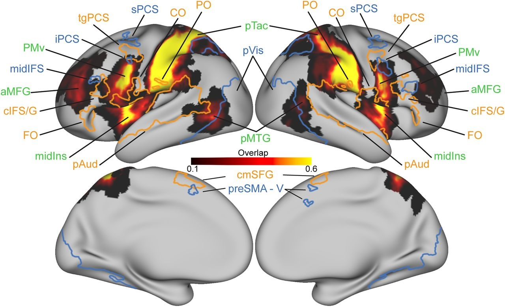

I'm a cognitive neuroscientist who studies attention and working memory. My central area of investigation is  how our sensory input constrains and shapes higher-level cognition. A second line of work tests the role of predictability and expectation.

As co-director of CMU's Laboratory in Multisensory Neuroscience, I work on a wide variety of research questions and methodological approaches. Our skills span from basic psychophysics to complex neuroimaging work.

Below are recent posters from our group, as well as brief descriptions of my current research areas. Publications are listed under [Publications](/pubs)

---

## Recent LiMN posters

Images link to full pdf; will open in new tab.



---

## Cortical networks for visual and auditory short-term memory

 

*Prototypical visual- and auditory-biased regions overlain on tactile-biased regions (Tobyne et al., 2025).*

I established a robust, reliable method of using fMRI to map sensory-biased
cortical networks, using auditory and visual working memory activation in
individual subjects. I have characterized these networks' organization,
behavior, and connectivity, showing that discrete sub-regions of
prefrontal cortex carry strong preferences for specific sensory
modalities. Auditory-biased networks are slightly left-lateralized and
extremely selective for auditory cognition; visual-biased networks are
slightly right-lateralized and more general in their activation. More
recent work has extended this map throughout frontal cortex and into
posterior parietal cortex, has shown that an individual's resting-state
connectivity patterns can be used to predict where their sensory-biased
regions will appear, and — by combining auditory, tactile, and visual
working memory in the same participants — has revealed both
modality-biased and supramodal working memory regions in human frontal
cortex.

* Tobyne, S. M., Brissenden, J. A., **Noyce, A. L.**, & Somers, D. C. (2025). Combined auditory, tactile, and visual fMRI reveals sensory-biased and supramodal working memory regions in human frontal cortex. *Journal of Neuroscience*, 45(38), 1–18. 

* **Noyce, A. L.**, Lefco, R., Tobyne, S. M., Brissenden, J. A., Shinn-Cunningham, B. G., & Somers, D. C. (2022). Extended frontal networks for visual and auditory working memory. *Cerebral Cortex*, *32*(4), 855–869.

* Lefco, R. W., Brissenden, J. A., **Noyce, A. L.**, Tobyne, S. M., & Somers, D. C. (2020). Gradients of functional organization in posterior parietal cortex revealed by visual attention, visual short-term memory, and intrinsic functional connectivity. *NeuroImage*, *219*, 117029.

---

## Distinguishing auditory attention states

Using fMRI and EEG in conjunction with representational analysis
techniques, I have shown when and where in the brain auditory attention
is represented. While many aspects of attention are similar regardless of
what is being attended to, the underlying brain states carry critical
information about the cue or feature that is being used. Our results have
demonstrated that the target of auditory attention is briefly represented
in evoked neural responses but sustained in oscillatory activity, and we
have identified key regions in sensory, parietal, and prefrontal cortex
that encode attentional state. We have also pinned down the level of the
auditory hierarchy at which top-down attention takes hold: attending to
pseudo-tone melodies enhances cortical responses but leaves brainstem
responses unchanged, placing this attentional gain at cortical rather
than subcortical stages. This program of work has informed a broader
theoretical framework for defining attention from an auditory
perspective, and has surfaced individual differences in how strongly
top-down attention modulates auditory-evoked responses — for example,
between neurotypical and ADHD young adults.

---

## Perceptual organization in working memory

By exploring the relationships among perceptual organization,
inter-stimulus similarity, and working memory task demands, I have shown
that how listeners group sound objects into memory items critically impacts
their accessibility at retrieval. This work builds on my doctoral
exploration of the learning processes by which arbitrary visuospatial
trajectories become familiar paths.

---
## Information domains associated with sensory modality. 

Vision's innate affinity for spatial information and audition's innate
affinity for temporal information affect people's ability to encode
information into working memory. Further, spatial attention and working
memory activate brain activity characteristic of visual processing
regardless of sensory modality. Using carefully matched visual and auditory
tasks, I have shown that when task demands require auditory spatial
processing or visual temporal processing, people recruit cognitive
machinery usually associated with the "other" sensory modality. More
recent work has extended this picture to dual-task contexts, showing that
interference between perception and working memory depends jointly on
sensory modality and information domain.

---

## Prediction and familiarity of distractors in attention 

Most studies of attention have disregarded the non-target distractors;
my work explores how the predictability and properties of distractors
shape focused attention. Across flanker-task and related paradigms, we
have tested the probability of various distractor configurations as well
as the role of predictable timing, and we consistently find that
predictable distractors are easier to ignore, supporting better
attention performance. EEG markers of these processes — including
dissociable P3 components elicited by violations of newly-learned
predictions — point to a flexible, online updating of distractor
expectations, and recent flanker-task work shows that these adjustments
occur both anticipatorily and on the fly. In the auditory domain, we
have characterized which features of an interrupting sound make it more
disruptive to the listener's ongoing task, and have shown that
task-irrelevant properties of an interrupting talker — their identity
and their continuity across the interruption — shape spatial selective
attention even when the listener has no reason to attend to them.
